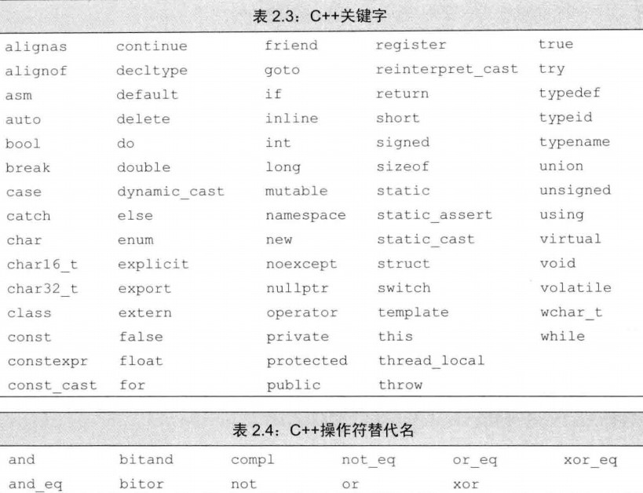

# 第二章 变量和基本类型
## 2.1 *基本内置类型*
* **数据类型**决定了程序中数据和操作的意义，是程序的基础。
* **基本内置类型**：算术类型（arithmetic type）和空类型（void type）
### 2.1.1 算数类型
* **算术类型**：整形（integral type，包括字符和布尔型在内）和浮点型。不同机器上算数类型的尺寸不同。下表为**c++算术类型表**
    |类型         |含义        |最小尺寸   |
    |:---------  |:---------  |:--------  |
    |bool         |布尔类型    |未定义     |
    |char         |字符        |8位       |
    |wchar_t      |宽字符      |16位       |
    |char16_t     |Unicode字符 |16位     |
    |char32_t     |Unicode字符 |32位     |
    |short        |短整型      |16位     |
    |int          |整型        |16位     |
    |long         |长整型      |32位     |
    |long long    |长整型      |64位     |
    |float        |单精度浮点数 |6位有效数字 |
    |double       |双精度浮点数 |10位有效数字 |
    |long double  |扩散精度浮点数|10位有效数字 |
    * 布尔类型（bool）的取值是true和false。
    * 一个char和一个机器字节的大小一样。在计算机中，一串数码作为一个整体来处理或运算的，称为一个计算机字，简称宇。
    * 尺寸上short <= int <= long <= long long
    * long long 是c++11新定义的。
* 带符号类型和无符号类型：除去布尔型和扩展的字符型之外，其他整型还可以划分为带符号的（signed）和无符号的（unsigned）两种。
    * 字符型被分为了3种：char，signed char和unsigned char。char与signed char不一样。但是字符的表现形式却只有两种，带符号的和无符号的，char是哪一种具体由是哪种编译器决定。
* 类型选择建议：
  * 明确知晓数值不可能为负时，选用无符号类型。
  * 使用int执行整数运算，超过了则用long long，因为short太小而long通常和int大小一样。
  * 算数表达式中不要用char或bool，因为char有无符号视机器而定，，非要使用的话可以明确指定signed char和unsigned char。
  *执行浮点运算选double。现在float和double的代价相似，甚至double在某些机器上更快，long double一般没必要，而且代价更大。
### 2.1.2 类型转换
将在p141具体讲解
### 2.1.3 字面值常量
&emsp; 一个形如42的值被称作**字面值常量**（literal），字面值**常量**的形式和值决定了它的数据类型。
* 整型和浮点型字面值：
  * 以数字0开头的整数代表八进制，如024。
  * 以0x或0X（数字零字母X）开头的整数代表十六进制，如0x14。
  * **默认**情况下十进制字面值是带符号数，八进制和十六进制可能带也可能不带符号。
  * 十进制字面值的类型是int，long，long long中尺寸最小的那个（前提是这种类型容纳的下）。
  * 八进制和十六进制字面值的类型是int、unsigned int、long、unsigned long、long long、unsigned long long中尺寸最小的那个（前提是这种类型容纳的下）。
  * 类型short没有对应的字面值。
  * **默认**浮点型字面值是一个double。<br />3.1415、3.1415E0、0.（0之后加一个小数点）、0e0、.001等都是浮点型。
* 字符和字符串字面值
  * 单引号括起来的一个字符被称为char型字面值，如'a'。
  * 双引号括起来的零个或多个字符则构成字符串型字面值,如"hello world!"。
  * 字符串型字面值的类型是由常量字符构成的**数组**（array），不是std::string型的。编译器在每个字符串的结尾添加一空字符（'\0'）。
* 两类字符不能直接使用，一类是不可打印的字符，因为没有可视的图符（）；一类是在C++语言中有特殊含义的字符（单、双引号，问号，反斜线）。这些情况下可以使用**转义序列**（escape sequence）
    |C++转义序列   ||||||
    |:---------  |:---------  |:--------  |:--------  |:--------  |:--------  |
    |换行符   |\\n   |横向制表符  |\\t  |报警铃    |\\a   |
    |退格符   |\\b   |纵向制表符  |\\v  |双引号    |\\"  |
    |反斜线   |\\\  |问号        |\\? |单引号   |\\'  |
    |回车符   |\\r   |进纸符      |\\f  |||
* **泛化的转义序列**：其形式是\\x后紧跟一个或多个十六进制数字，或者\\后紧跟1个、2个或3个八进制数字，八进制数字超过3个则只有前3个与\\工程转移序列，而\\x则用到后面所有数字。下面是一些示例：
  * \\7（响铃）
  * \\12（换行符）
  * \\40（空格）
  * \\0（空字符）
  * \\115（字符M）
  * \\x4d（字符M）
* 指定字面值的类型
  * 字符和字符串字面值：
    |前缀  |含义          |类型      |
    |:--- |:---------    |:-------  |
    |u    |Unicode16字符  |char16_t  |
    |U    |Unicode32字符  |chr32_t  |
    |L    |宽字符         |wchar_t   |
    |u8   |UTF-8（仅用于字符串字面常量）|char|
  * 整型字面值：十进制、八进制和十六进制都适用
    |后缀  |最小匹配类型 |
    |:---- |:---------  |
    |u或U  |unsigned   |
    |l或L  |long       |
    |ll或LL|long long  |
      * 对于一个整数来说，U和L或LL可以混合在一起使用，如UL为后缀的字面值或取unsigned long，或取unsigned long long
  * 浮点型字面值：
    |后缀  |类型 |
    |:---- |:---------  |
    |f或F  |float    |
    |l或L  |**long double**|
* 布尔字面值和指针字面值
  * true和false是bool类型的字面值
  * nullptr是指针字面值
## 2.2 *变量*
### 2.2.1 变量定义
* 变量的定义的基本形式：**类型说明符**（type specifier），随后紧跟一个或多个变量名组成的列表，变量名以逗号隔开，最后以分号结束；定义时还可以为一个多个变量赋初值。
* 通常情况下，对象指一块能储存数据并具有某种类型的内存空间。
* **初始化不是赋值**，初始化是创建变量时便赋予其一个初始值，而赋值则是将对象当前值擦除，用一个新值代替。
* 4种初始化形式：
  * `int a = 0;`
  * `int a = {0};`
  * `int a{0};`
  * `int a(0);`
  * 花括号来初始化是C++11新标准，这种初始化形式被称为**列表初始化**（list initialization），无论是初始化对象还是为对象赋新值，都可以使用这样一组花括号括起来的初始值，过去这种方法仅用于某些受限的场合。对内置类型变量使用列表初始化时，如果初始值存在丢失信息的风险，编译器将报错。
* 默认初始化：如果变量定义时没有指定初值，则变量被默认初始化，被赋予默认值，默认值由变量类型及定义的位置决定。
  * 内置类型变量未被显式初始化,它的值由定义的位置决定：
    * 定义于任意函数体之外的内置类型变量被初始化为0.
    * 定义于函数体内的内置类型变量**不被初始化**（uninitialized），其值是未被定义的，任何试图拷贝或访问此类值豆浆引发错误。
    * *建议初始化每一个内置类型的的变量。*
  * 每个类各自决定其初始化对象的方式。
  * 绝大多数类都支持无须显式初始化而定义对象，这样的类提供了一个默认值。如string类规定默认值为空串。
### 2.2.2变量声明与定义的关系
* 变量的声明：一条声明语句由一个**基本数据类型**（base type）和紧随其后的一个**声明符**（declarator）列表组成。每个声明符命名了一个变量并指定该变量为与基本数据类型**有关**的某种类型。
* 声明符 = */\&/什么都没 + 变量名。（中间可有可无间隔，*和\&也可以紧跟在基本数据类型后，但是它依然是声明符的一部分而非基本数据类型的一部分），还有比这更复杂的声明符。
* 分离式编译（separate compilation）：该机制孕育将程序分割为若干个文件，每个文件可以单独编译。为了支持该机制，C++将声明和定义区分开来
* 变量声明与定义的比较：
  1. 声明（declaration）使得名字为程序所知，而定义（definition）则负责创建与名字关联的实体。
  2. 变量声明和定义都规定了变量的类型和名字，但是定义还申请存储空间，也可能为变量赋一个初值。
  3. 如果想声明一个变量而不是定义它，就在变量名前加一个extern，而且不要显示的初始化变量。如：`extern int i; //是声明而非定义。 `
  4. 变量能且只能定义一次，但可以被多次声明。如果多个文件中使用同一变量，就必须将声明和定义分离。变量的定义必须且只能出现在一个文化中，其他文件若要使用必须对其进行声明，绝不能重复定义。在函数体内部，如果试图初始化一个有extern关键字标记的变量，将引发错误。
### 2.2.3 标识符
* **命名规则**：
  1. C++标识符由字母、数字和下下划线组成，且必须以字母或下划线开头；
  2. 长度不限制，区分大小写；
  3. 不能使用C++关键字和操作符替代符；
  4. 用户自定义的标识符中不能连续出现两个下划线，不能下划线紧邻大写字母开头；
  5. 定义于函数体外的表示符不能以下划线开头。
  <br />
* 一些约定俗成的规范：
  1. 标识符要能体现实际含义。
  2. 变量名一般用小写字母。
  3. 用户自定义类一般以大写字母开头。
  4. 若标识符由多个单词组成，单词间应有明显的区分。
### 2.2.4 名字的作用域
* 作用域（scope）
  * 同一个名字在不同的作用域中可能指不同的实体。
  * 作用域是程序的一部分，在其中名字有其特定的含义。
  * C++语言中大多数作用域以花括号分割。
  * 名字的有效区域始于名字的声明语句，以声明语句所在的作用域末端为结束。
* 大多数定义于函数体之外的名字具有全局作用域（global scope），比如main函数的名字main。全局作用域本身没有名字，可以使用`::全局变量名`（::左侧什么都没）来显式访问全局变量。
* 定义于某个函数中的名字拥有块作用域（block scope）。
* 作用域可以包含彼此，被包含（或者说被嵌套）的作用域称为内层作用域（inner scope），包含着别的作用域的作用域称为外层作用域（outer scope）。
* **建议**：
  1. 当第一次使用变量时在定义它。
  2. 如果函数可能用到全局变量，则不宜再定义一个同名的局部变量。
## 2.3 *复合类型*（compoud type）
**复合类型**是指基于其他类型定义的类型。
* 复合类型变量的声明：一条声明语句由一个**基本数据类型**（base type）和紧随其后的一个**声明符**（declarator）列表组成。每个声明符命名了一个变量并指定该变量为与基本数据类型**有关**的某种类型。
* 声明符 = \*/\&/什么都没 + 变量名。（中间可有可无间隔，\*和\&也可以紧跟在基本数据类型后，但是它依然是声明符的一部分而非基本数据类型的一部分），还有比这更复杂的声明符。\*和\&是类型修饰符。
### 2.3.1 引用（reference）
* **引用**（reference）为对象起了另外一个名字，引用类型引用（refers to）另外一种类型。
  * 通过将声明符写成\&d的形式来定义引用类型，其中d是声明的变量名。
   ```c++
    int i = 1024;
    int &d1 = i;        //d1指向i
    int &d2;            //错误，引用必须被初始化
    auto &h = 42;       //错误，不能为非常量引用绑定字面值
    const auto &j =42;  //正确，可以为常量引用绑定字面值
  ```
  * 引用并非对象，它只是为一个已经存在的对象起的另一个名字。
  * 定义引用时，程序将引用和它的初始值绑定（bind）在一起，而不是将初始值拷贝给引用。一旦初始化完成，引用将和它的初始对象一直绑定在一起。因为无法使引用重新绑定到另一个对象，所以**引用必须初始化**。
  * 引用的定义：
    * 允许一条语句定义多个引用，其中每个引用标识符都必须以\&开头。
    * 一般来说，引用的类型要和与之绑定的对象严格匹配。
      * 例外1：初始化常量引用时允许任意表达式作为初始值，只要表达式结果**可以转化**为引用的类型即可。允许为一个常量引用绑定一个非常量对象、字面值，甚至是一个一般表达式。
      * 例外2：p534
      * 除了上述两种例外外，引用只能绑定在对象上，而引用本身不是对象，所以不能定义引用的引用；而且引用（不是常量引用）不能与字面值（字面值是常量）或某个表达式计算结果绑定在一起。
### 2.3.2 指针
* 指针（pointer）是指向（point to）另外一种类型的复合类型。
* 指针与引用的异同与关系：
  1. 指针本身是一个对象，允许对指针赋值和拷贝，而且在指针的生命周期内它可以先后指向几个不同对象。
  2. 指针无须在定义时赋初值。与其他内置类型相同，在块作用域内定义的指针如果未被显式初始化，则也拥有一个不确定的值。
  3. 因为引用不是对象，没有实际地址，所以不能定义指向引用的指针。
  4. 二者都可以提供对其他对象的间接访问，但是引用本身不是对象，一旦定义引用就不能再将它绑定到另一对象上，每次访问都是最初绑定的对象；与其他任何变量（引用除外）一样，给指针赋值就是给他新地址，从而指向另一对象。
  5. 二者都必须注意格式的匹配。
* 指针的定义：
  * 将声明符写成*d的形式，d为变量名。
  * \&为取地址符 如\&a即为int型变量a的地址
* 指针值（即地址）应属下面4中状态：
  1. 指向一个对象
  2. 指向紧邻对象所占空间的下一个位置
  3. 空指针，以为指针没有指向任何对象
  4. 无效指针，不属于上述情况的其他值
      * 试图拷贝或以其他方式试图访问无效指针的值将引发错误，与试图使用未初始化的变量是一样的，编译器不负责检测此类错误。
      * 第2和第3种的指针虽然有效，但其使用依然受限。因为这些指针没有指向任何对象，则不允许对其指向的对象进行访问，否则后或无法预料。
* 利用指针访问对象：使用解引用符\*，如\*d即是指针d所指的对象。解引用操作仅适用于哪些确实指向了某个对象的有效指针。
* 空指针（null pointer）：不指向任何对象，在试图使用一个指针之前代码可以先检查它是否为空，下面是生成空指针的方法：<br />`int *p1 = nullptr;//这里的nullptr（c++11新标准）可以换为0或NULL（NULL为预处理变量，定义在头文件cstdlib中），都是等价的`
* **建议** ：初始化所有指针，如果不清楚指针指向谁，直接初始化为nullptr或0。
* 指针值是0，就是false，非0则为true。类型相同的指针进行比较，可以用==或者!=来比较他们，结果是bool型。
* void\* 指针： **void\***指针是一种可以存放任意地址的指针，但是不知道其中地址指向的对象的类型。所以只能用作：（p726,p144）
  * 拿他和别的指针比较；
  * 作为函数的输入或输出；
  * 赋给另外一个void\*指针。
### 2.3.3 理解复合类型的声明
* 由于在定义语句中基本数据类型只有一个，声明符的形式可以不同，所以一条定义语句可能定义出不同类型的变量。
* 如前所述，类型修饰符（\*或\&）是声明符的一部分，只能作用于紧挨着的一个变量。
* 我采取将\*或\&与变量名连在一起的写法。
* \*的个数可以来区分指针的级别。即\*\*表示指向指针的指针，\*\*\*表示指向指向指针的指针的指针，以此类推。
* 指向指针的引用：
  ```c++
  int  i = 42;
  int *p = &i;    //p是一个int型指针
  int *&r = p;    //r是对指针p的一个引用
  r = &i;         //通过p的引用r，使得指针p指向i
  *r = 0;         //解引用r得到i
  ```
* 面对较复杂的指针或引用的声明语句时，从右向左阅读， 变量名最近的符号对变量的类型用最直接的影响。
## 2.4 *const限定符*
* 定义值不能被改变的变量使用const关键字，const对象一旦创建后其值就不能再改变，因此必须初始化。
* const对象与一般对象的区别就是不能进行改变其对象内容的操作。
* 利用一个对象去初始化一个const对象，不用在意它是不是const类型。拷贝一个值不会去改变它，拷贝完成后，新的对象和旧的对象之间没什么关系。
* **默认状态下***，const对象仅在文件内有效，当多个文件出现同名的const变量时，等同于多个不同文件中定义了独立的变量。
  * 如果想在多个文件中共享const对象，必须在变量的定义之前添加extern关键字，其他文件中想用只需声明并且在声明前也添加extern即可。
### 2.4.1 const的引用
* 对常量的引用：把引用绑定到const对象上
  * 对常量的引用不能用作修改它所绑定的对象
  * 引用的类型必须与其所引用对象一致，但有两个例外：
    * 例外1：初始化常量引用时允许任意表达式作为初始值，只要表达式结果**可以转化**为引用的类型即可。允许为一个常量引用绑定一个非常量对象、字面值，甚至是一个一般表达式。
    * 例外2：p534
  ```c++
  const int ci = 1024;
  const int &r1 = ci; //right
  r1 = 42; //error
  int &r2 = ci; //错误，试图让一个非常量引用指向一个常量对象
  ```
* 临时量（temporary）对象：当编译器需要一个空间暂存表达式的求值结果时临时创建的一个未命名对象。
